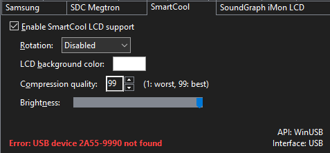

# AIDA64 - AX206 / SmartCool LCD Driver Install

How to install drivers for AX206 / SmartCool LCD device. These are steps that worked for me across multiple machines. It is unlikely, but you may need to adjust the configuration accordingly.

If you have a contribution, please fork and send a pull request.
## Installation
- Download [samsung_spf_lcd_driver.zip](https://github.com/upioneer/AIDA64/blob/main/samsung_spf_lcd_driver.zip)
- Extract samsung_spf_lcd_driver.zip
- Install `samsung_spf_lcd_driver\new driver (2021)\samsung_spf.inf` (right-click > click Install)
- Install `samsung_spf_lcd_driver\old driver (2014)\installer_x64.exe`
- Install [Zadig](https://github.com/upioneer/AIDA64/blob/main/zadig-2.8.exe)
- Install [AIDA64](https://www.aida64.com/downloads)
## Configuration
**Zadig**
- Select your USB display from the drop down
- Select `libusb-win32 (v1.2.7.3)` as the driver
- Click `Install WCID Driver`

**AIDA64**
- Go to File > Preferences > LCD
- Check `Enable AX206 LCD support`

- Check `Enable SmartCool LCD support`

## Known Issues
- NIC assignments are often changed after reboot/shutdown
- If metrics are not reporting correctly just check if the NIC assignment number has changed

## References

- [AIDA64 7.20.6802](https://www.aida64.com/downloads/ZjNkZTY2ZDQ=)
- [AIDA64 downloads archive](https://www.aida64.com/downloads/archive)

## Authors

- [@upioneer](https://www.github.com/upioneer)
